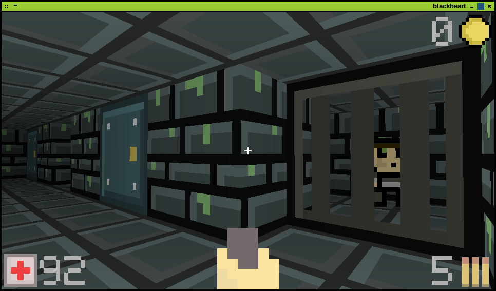

# blackheart

### Written for the [7dfps] challenge 2013

This is blackheart, my attempt at an FPS.

Requires Java or Open JDK 1.7+ to run...

### Dependencies (Not included)

* [LWJGL2]
* [slick-util]
* [JOrbis]
* [progaurd] *(optional)*

Please amend the post scripts as needed.

### Download

All the needful can be found at [blackheart.flob.io]

### Screenshot

---

## License

Copyright (c) 2013 Robert Calvert ([robert.calvert.io])

See the license file for license rights and limitations (GPLv2).

[7dfps]:http://7dfps.calvert.io
[blackheart.flob.io]:http://blackheart.flob.io

[LWJGL2]:http://www.lwjgl.org
[slick-util]:http://slick.ninjacave.com
[JOrbis]:http://www.jcraft.com/jorbis
[progaurd]:http://proguard.sourceforge.net
[robert.calvert.io]:http://robert.calvert.io

